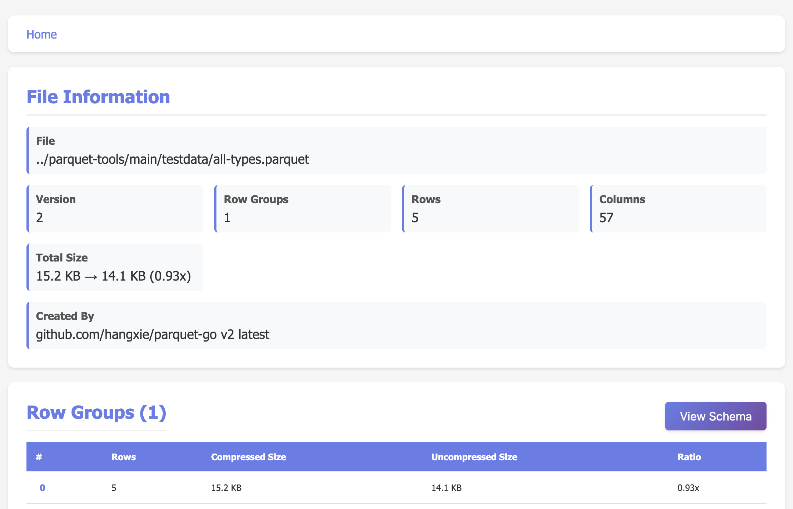
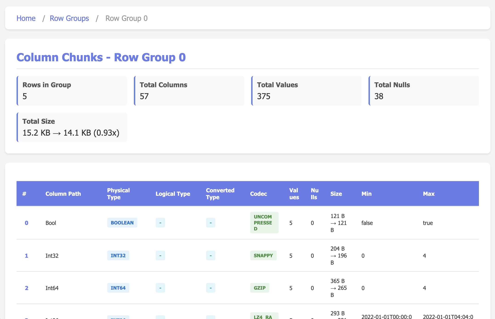
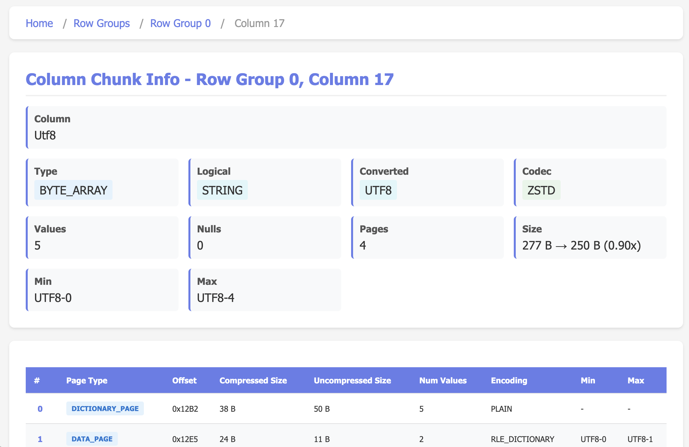
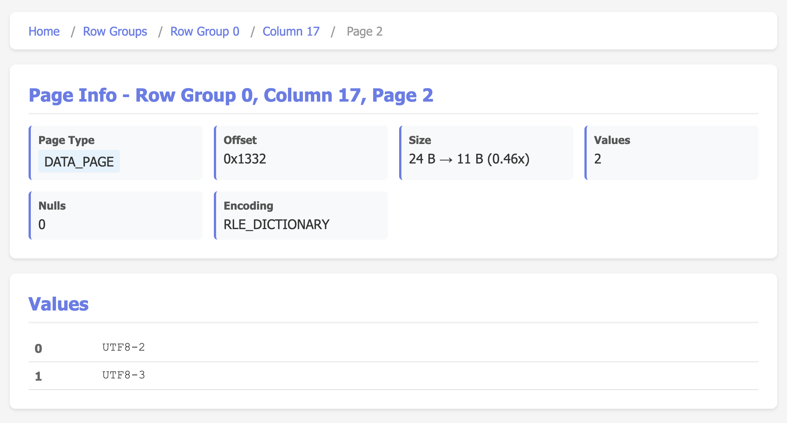

# parquet-browser

A triple-mode tool for browsing and inspecting Apache Parquet files:
- **TUI Mode**: Interactive Terminal User Interface for file browsing
- **Server Mode**: HTTP API server for programmatic access
- **Web UI Mode**: Modern web-based interface with HTMX for interactive browsing

This tool is built upon [`github.com/hangxie/parquet-tools`](https://github.com/hangxie/parquet-tools) and [`github.com/hangxie/parquet-go`](https://github.com/hangxie/parquet-go). For batch processing or command-line operations on Parquet files, it is recommended to use `parquet-tools` directly.

## Backend Support

`parquet-browser` supports reading files from various storage systems, including:

- Local file system
- HTTP/HTTPS
- HDFS
- S3
- Google Cloud Storage (GCS)
- Azure Blob Storage

For URLs for different object store and access options, please refer to [Parquet File Location](https://github.com/hangxie/parquet-tools?tab=readme-ov-file#parquet-file-location).

## Features

### Triple-Mode Operation
- **TUI Mode**: Interactive terminal interface with embedded HTTP server
- **Server Mode**: Standalone HTTP API server for programmatic access
- **Web UI Mode**: Modern browser-based interface with HTMX for dynamic updates
- **HTTP API**: Complete RESTful API with JSON responses
- **OpenAPI Documentation**: Swagger/OpenAPI 3.0 specification included ([swagger.yaml](swagger.yaml))

### TUI Features
- **Interactive File Browser**: Open parquet files through command line with loading progress and cancellation support (ESC or Ctrl+C)
- **File Summary View**: Quick overview of file metadata:
  - Version, row groups, total rows, leaf columns
  - Total compressed and uncompressed sizes with compression ratio
  - Created by information
- **Schema Viewer**: View schema in multiple formats (JSON, Raw, Go Struct, CSV) with:
  - Direct format switching with 'g' (Go), 'j' (JSON), 'r' (Raw), 'c' (CSV)
  - Pretty/compact mode toggle with 'p' key (JSON and Raw formats)
  - Copy to clipboard with 'y' key (yank)
  - Support for complex types (LIST, MAP, STRUCT)
- **Row Group Explorer**: Browse row groups with detailed information:
  - Row count per group
  - Number of columns
  - Total values and total nulls across all columns
  - Size display: compressed → uncompressed (ratio)
  - Easy navigation with arrow keys
  - Press Enter to view column chunks
- **Column Chunk Inspector**: Deep dive into column storage:
  - Column path (max 30 chars for better layout), physical type, logical type, converted type
  - Compression codec
  - Number of values and null count
  - Size: compressed → uncompressed (ratio)
  - Min/Max statistics for data distribution analysis
  - Press Enter to view page-level details
- **Page-Level Details**: Inspect internal page structure:
  - View all pages (DATA_PAGE, DATA_PAGE_V2, DICTIONARY_PAGE, INDEX_PAGE)
  - Page type (max 15 chars for better layout), offsets, compressed/uncompressed sizes
  - Number of values, encoding information
  - Min/Max statistics per page for data distribution analysis
  - Null count per page
  - Press Enter to view actual page content
- **Page Content Viewer**: Browse decoded page values:
  - Complete page metadata header (type, offset, size, values count, encoding)
  - Display all values from a single page
  - Smart value formatting (UTF-8 strings, hex for binary data)
  - Row numbers for reference
  - Handles NULL values explicitly
- **Type-Aware Display**: Proper handling of complex Parquet types (LIST, MAP, STRUCT, DECIMAL, TIMESTAMP, etc.)
- **Error Handling**: Graceful error handling with cancellable loading operations
- **Keyboard Navigation**: Full keyboard support for efficient browsing

### Web UI Features
- **Modern Browser Interface**: Clean, responsive web interface with HTMX for dynamic updates
- **File Overview**: Home page displays file metadata and all row groups at once
- **Schema Viewer**: View schema in multiple formats (Go, JSON, Raw, CSV) with syntax highlighting
- **Row Group Browser**: Navigate through row groups with detailed statistics
  - Total values and total nulls per row group
  - Size information: compressed → uncompressed (ratio)
- **Column Chunk Inspector**: Explore column storage with complete metadata
  - Min/Max statistics for each column chunk
  - Type information (physical, logical, converted)
  - Compression codec and size details
- **Page Inspector**: View page-level details for column chunks
  - Complete column chunk metadata in header
  - Min/Max statistics for each page
  - Page type, offset, encoding, and size information
- **Page Content Viewer**: Browse actual data values
  - Complete page metadata header
  - All decoded values from the page
  - Smart formatting for different data types
- **Breadcrumb Navigation**: Easy navigation back to any level
- **No JavaScript Required**: Progressive enhancement with HTMX

## Installation

```bash
go build -o parquet-browser
```

Or install directly:

```bash
go install github.com/hangxie/parquet-browser@latest
```

## Usage

### TUI Mode (Interactive Browser)

Open a file directly in the TUI:

```bash
./parquet-browser tui path/to/file.parquet
```

The application will show a loading modal and then display the file contents. Press ESC during loading to cancel.

**How it works:**
- Starts an embedded HTTP server on a random localhost port
- Server runs in "quiet mode" (no console logging)
- TUI communicates with the server via HTTP
- Server shuts down automatically when TUI exits

### Server Mode (HTTP API)

Run as a standalone HTTP API server:

```bash
# Start server on default port (:8080)
./parquet-browser serve file.parquet

# Start server on custom port
./parquet-browser serve -a :9090 file.parquet
```

The server provides RESTful endpoints for programmatic access. See [API Documentation](#http-api) below.

### Web UI Mode

Run the web-based interface:

```bash
# Start web UI on random available port (default)
./parquet-browser web-ui file.parquet

# Start web UI on custom port
./parquet-browser web-ui -a :9090 file.parquet
```

The web UI will automatically open in your default browser. By default, a random available port is used to avoid conflicts. Navigate through file metadata, row groups, column chunks, pages, and view actual data values in a modern web interface.

### Open Remote Files

Works in all three modes (TUI, server, and web UI):

```bash
# S3
./parquet-browser tui s3://bucket/path/to/file.parquet
./parquet-browser serve s3://bucket/path/to/file.parquet

# HTTP/HTTPS
./parquet-browser tui https://example.com/data.parquet
./parquet-browser serve https://example.com/data.parquet

# With additional options
./parquet-browser tui --anonymous wasbs://laborstatisticscontainer@azureopendatastorage.blob.core.windows.net/lfs/part-00000-tid-6312913918496818658-3a88e4f5-ebeb-4691-bfb6-e7bd5d4f2dd0-63558-c000.snappy.parquet
./parquet-browser tui --http-ignore-tls-error https://example.com/file.parquet
```

### Help

```bash
./parquet-browser --help
```

Display usage information and available flags.

### Keyboard Shortcuts

#### Main View (Row Groups)
- `↑` / `↓`: Navigate through row groups
- `Enter`: View column chunks for selected row group
- `s`: Show schema viewer
- `q` / `Esc`: Quit application

#### Schema Viewer
- `g`: Switch to Go Struct format
- `j`: Switch to JSON format
- `r`: Switch to Raw format
- `c`: Switch to CSV format
- `p`: Toggle pretty/compact mode (JSON and Raw only)
- `y`: Copy schema to clipboard (yank)
- `Esc`: Close schema viewer

#### Column Chunks View
- `↑` / `↓`: Navigate through column chunks
- `Enter`: View page-level details for selected column chunk
- `Esc`: Close column chunks view

#### Page Details View
- `↑` / `↓`: Navigate through pages
- `Enter`: View page content (all decoded values)
- `Esc`: Close page details view

#### Page Content View
- `↑` / `↓`: Navigate through values
- `Esc`: Close page content view

#### Loading Modals
- `Esc` / `Ctrl+C`: Cancel loading operation

## Interface Layout

### Main Screen

```
┌ File Info ──────────────────────────────────────────────────────────────────────────────────────┐
│File: all-types.parquet                                                                          │
│Version: 2  Row Groups: 1  Rows: 5  Columns: 57                                                  │
│Total Size: 15.2 KB → 14.1 KB (0.93x)  Created By: github.com/hangxie/parquet-go v2 latest       │
└─────────────────────────────────────────────────────────────────────────────────────────────────┘
╔ Row Groups (↑↓ to navigate) ════════════════════════════════════════════════════════════════════╗
║#│Rows│      Size                                                                                ║
║0│   5│15.2 KB → 14.1 KB                                                                         ║
║                                                                                                 ║
║                                                                                                 ║
║                                                                                                 ║
║                                                                                                 ║
║                                                                                                 ║
║                                                                                                 ║
║                                                                                                 ║
║                                                                                                 ║
║                                                                                                 ║
║                                                                                                 ║
║                                                                                                 ║
║                                                                                                 ║
║                                                                                                 ║
╚═════════════════════════════════════════════════════════════════════════════════════════════════╝
 Keys: ESC=quit, s=schema, ↑↓=scroll, Enter=see item details  v0.0.20
```


Features:
- **File Info**: File name on top, followed by version, row groups, total rows, leaf columns count
- **Total Size**: Shows compressed → uncompressed size with compression ratio
- **Row Groups**: Lists all row groups with index, row count, and compressed → uncompressed size
- **Status Line**: Keyboard shortcuts only (ESC, s, arrows, Enter)
- **Press Enter**: View column chunks for selected row group

### Column Chunks View

Press `Enter` on a row group:

```
┌──────────────────────────────────────── Row Group Info ─────────────────────────────────────────┐
│Row Group: 0  Rows: 5  Columns: 57                                                               │
│Total Values: 375  Total Nulls: 38                                                               │
│Size: 15.2 KB → 14.1 KB (0.93x)                                                                  │
└─────────────────────────────────────────────────────────────────────────────────────────────────┘
╔ Column Chunks (↑↓ to navigate, Enter=view pages) ═══════════════════════════════════════════════╗
║ #│   Name   │        Type        │    Codec   │Size │          Min          │        Max        ║
║ 0│Bool      │BOOLEAN             │UNCOMPRESSED│121 B│false                  │true               ║
║ 1│Int32     │INT32               │SNAPPY      │204 B│0                      │4                  ║
║ 2│Int64     │INT64               │GZIP        │365 B│0                      │4                  ║
║ 3│Int96     │INT96               │LZ4_RAW     │293 B│2022-01-01T00:00:00....│2022-01-01T04:04:0…║
║ 4│Float     │FLOAT               │ZSTD        │194 B│0                      │2                  ║
║ 5│Float16Val│FIXED_LEN_BYTE_ARRAY│BROTLI      │133 B│0                      │2                  ║
║ 6│Double    │DOUBLE              │UNCOMPRESSED│223 B│0                      │2                  ║
║ 7│ByteArray │BYTE_ARRAY          │SNAPPY      │304 B│Qnl0ZUFycmF5LTA=       │Qnl0ZUFycmF5LTQ=   ║
║ 8│Enum      │BYTE_ARRAY          │GZIP        │351 B│Enum-0                 │Enum-4             ║
║ 9│Uuid      │FIXED_LEN_BYTE_ARRAY│LZ4_RAW     │331 B│00000000-0000-0000-0...│04040404-0404-0404…║
║10│Json      │BYTE_ARRAY          │ZSTD        │303 B│{"0":0}                │{"4":4}            ║
║11│Bson      │BYTE_ARRAY          │BROTLI      │319 B│{"0":0}                │{"4":4}            ║
║12│Json2     │BYTE_ARRAY          │UNCOMPRESSED│267 B│{"0":0}                │{"4":4}            ║
║13│Bson2     │BYTE_ARRAY          │SNAPPY      │324 B│{"0":0}                │{"4":4}            ║
╚═════════════════════════════════════════════════════════════════════════════════════════════════╝
 Keys: ESC=back, s=schema, ↑↓=scroll, Enter=view pages  v0.0.20
```


Features:
- **Row Group Info**: Row group number, rows, columns, total values/nulls, size (3-line header)
- **Column details**: Name (max 30 chars), physical type, codec, compressed size, and Min/Max statistics
- **Status Line**: Consistent keyboard shortcuts across all views
- **Press Enter**: View page-level details for selected column chunk

### Page Details View

Press `Enter` on a column chunk:

```
┌─────────────────────────────────────── Column Chunk Info ───────────────────────────────────────┐
│Column: Utf8  Type: BYTE_ARRAY  Logical: STRING  Converted: UTF8                                 │
│Values: 5  Codec: ZSTD  Size: 277 B → 250 B (0.90x)                                              │
│Nulls: 0  Pages: 4                                                                               │
│Min: UTF8-0  Max: UTF8-4                                                                         │
└─────────────────────────────────────────────────────────────────────────────────────────────────┘
╔ Pages (↑↓ to navigate, Enter=view values) ══════════════════════════════════════════════════════╗
║#│   Page Type   │Offset│Comp Size│Uncomp Size│Values│   Encoding   │  Min │  Max                ║
║0│DICTIONARY_PAGE│0x12B2│     38 B│       50 B│     5│PLAIN         │-     │-                    ║
║1│DATA_PAGE      │0x12E5│     24 B│       11 B│     2│RLE_DICTIONARY│UTF8-0│UTF8-1               ║
║2│DATA_PAGE      │0x1332│     24 B│       11 B│     2│RLE_DICTIONARY│UTF8-2│UTF8-3               ║
║3│DATA_PAGE      │0x137F│     19 B│        6 B│     1│RLE_DICTIONARY│UTF8-4│UTF8-4               ║
║                                                                                                 ║
║                                                                                                 ║
║                                                                                                 ║
║                                                                                                 ║
║                                                                                                 ║
║                                                                                                 ║
║                                                                                                 ║
║                                                                                                 ║
║                                                                                                 ║
╚═════════════════════════════════════════════════════════════════════════════════════════════════╝
 Keys: ESC=back, s=schema, ↑↓=scroll, Enter=see item details  v0.0.20
```


Features:
- **Column Chunk Info**: Column name/type, codec, compressed/uncompressed size, null count, page count, Min/Max (4-line header)
- **Statistics**: Min/Max values at both column chunk and page level, null counts
- **Page List**: All pages with offsets, sizes, value counts, encodings, and Min/Max statistics
- **Status Line**: Consistent keyboard shortcuts
- **Press Enter**: View decoded page content

### Page Content View

Press `Enter` on a page:

```
┌─────────────────────────────────────────── Page Info ───────────────────────────────────────────┐
│Page Type: DATA_PAGE  Offset: 0x1332  Size: 24 B → 11 B (0.46x)                                  │
│Values: 2  Nulls: 0  Encoding: RLE_DICTIONARY                                                    │
│Min: UTF8-2  Max: UTF8-3                                                                         │
└─────────────────────────────────────────────────────────────────────────────────────────────────┘
╔ Page Content (↑↓ to navigate) ══════════════════════════════════════════════════════════════════╗
║#│                                             Value                                             ║
║1│UTF8-2                                                                                         ║
║2│UTF8-3                                                                                         ║
║                                                                                                 ║
║                                                                                                 ║
║                                                                                                 ║
║                                                                                                 ║
║                                                                                                 ║
║                                                                                                 ║
║                                                                                                 ║
║                                                                                                 ║
║                                                                                                 ║
║                                                                                                 ║
║                                                                                                 ║
║                                                                                                 ║
╚═════════════════════════════════════════════════════════════════════════════════════════════════╝
 Keys: ESC=back, s=schema, ↑↓=scroll  v0.0.20
```


Features:
- **Page Info**: Type, offset, compressed/uncompressed size, value count, null count, encoding, Min/Max (3-line header)
- **All Values**: Displays all decoded values from the page
- **Smart Formatting**: UTF-8 strings, hex for binary, NULL handling
- **Row Numbers**: Numbered for easy reference
- **Status Line**: Consistent keyboard shortcuts

### Schema Viewer

Press `s` from any view:

Shows schema in multiple formats:
- **JSON format**: Structured JSON representation with type information
- **Raw format**: Internal parquet-go schema structure
- **Go Struct**: Generated Go struct code ready to use
- **CSV format**: Column definitions in CSV format (name, type, repetition)

Direct format switching:
- Press 'g' for Go Struct format
```
╔═════════════════════════════════════════════════════════════════════════════════════════════════╗
║               Schema [Go Struct] | ESC=close, g=go, j=json, r=raw, c=csv, y=copy                ║
║╔═══════════════════════════════════════════════════════════════════════════════════════════════╗║
║║type Parquet_go_root struct {                                                                  ║║
║║    Bool              bool             `parquet:"name=Bool, type=BOOLEAN, encoding=RLE, compres║║
║║sion=UNCOMPRESSED"`                                                                            ║║
║║    Int32             int32            `parquet:"name=Int32, type=INT32, encoding=RLE_DICTIONAR║║
║║Y, compression=SNAPPY"`                                                                        ║║
║║    Int64             int64            `parquet:"name=Int64, type=INT64, encoding=RLE_DICTIONAR║║
║║Y, compression=GZIP"`                                                                          ║║
║║    Int96             string           `parquet:"name=Int96, type=INT96, encoding=PLAIN, compre║║
║║ssion=LZ4_RAW"`                                                                                ║║
║║    Float             float32          `parquet:"name=Float, type=FLOAT, encoding=BYTE_STREAM_S║║
║║PLIT, compression=ZSTD"`                                                                       ║║
║║    Float16Val        string           `parquet:"name=Float16Val, type=FIXED_LEN_BYTE_ARRAY, le║║
║║ngth=2, logicaltype=FLOAT16, encoding=PLAIN, compression=BROTLI"`                              ║║
║║    Double            float64          `parquet:"name=Double, type=DOUBLE, encoding=BYTE_STREAM║║
║║_SPLIT, compression=UNCOMPRESSED"`                                                             ║║
║║    ByteArray         string           `parquet:"name=ByteArray, type=BYTE_ARRAY, encoding=RLE_║║
║║DICTIONARY, compression=SNAPPY"`                                                               ║║
║╚═══════════════════════════════════════════════════════════════════════════════════════════════╝║
║                                                                                                 ║
╚═════════════════════════════════════════════════════════════════════════════════════════════════╝
```
- Press 'j' for JSON format
```
╔═════════════════════════════════════════════════════════════════════════════════════════════════╗
║    Schema [JSON - Pretty] | ESC=close, g=go, j=json, r=raw, c=csv, p=pretty/compact, y=copy     ║
║╔═══════════════════════════════════════════════════════════════════════════════════════════════╗║
║║{                                                                                              ║║
║║  "Fields": [                                                                                  ║║
║║    {                                                                                          ║║
║║      "Tag": "name=Bool, inname=Bool, type=BOOLEAN, encoding=RLE, compression=UNCOMPRESSED"    ║║
║║    },                                                                                         ║║
║║    {                                                                                          ║║
║║      "Tag": "name=Int32, inname=Int32, type=INT32, encoding=RLE_DICTIONARY, compression=SNAPPY║║
║║                                                                                               ║║
║║    },                                                                                         ║║
║║    {                                                                                          ║║
║║      "Tag": "name=Int64, inname=Int64, type=INT64, encoding=RLE_DICTIONARY, compression=GZIP" ║║
║║    },                                                                                         ║║
║║    {                                                                                          ║║
║║      "Tag": "name=Int96, inname=Int96, type=INT96, encoding=PLAIN, compression=LZ4_RAW"       ║║
║║    },                                                                                         ║║
║║    {                                                                                          ║║
║║      "Tag": "name=Float, inname=Float, type=FLOAT, encoding=BYTE_STREAM_SPLIT, compression=ZST║║
║╚═══════════════════════════════════════════════════════════════════════════════════════════════╝║
║                                                                                                 ║
╚═════════════════════════════════════════════════════════════════════════════════════════════════╝
```
- Press 'r' for Raw format
```
╔═════════════════════════════════════════════════════════════════════════════════════════════════╗
║     Schema [RAW - Pretty] | ESC=close, g=go, j=json, r=raw, c=csv, p=pretty/compact, y=copy     ║
║╔═══════════════════════════════════════════════════════════════════════════════════════════════╗║
║║{                                                                                              ║║
║║  "children": [                                                                                ║║
║║    {                                                                                          ║║
║║      "compression_codec": "UNCOMPRESSED",                                                     ║║
║║      "encoding": "RLE",                                                                       ║║
║║      "field_id": 0,                                                                           ║║
║║      "name": "Bool",                                                                          ║║
║║      "precision": 0,                                                                          ║║
║║      "repetition_type": "REQUIRED",                                                           ║║
║║      "scale": 0,                                                                              ║║
║║      "type": "BOOLEAN",                                                                       ║║
║║      "type_length": 0                                                                         ║║
║║    },                                                                                         ║║
║║    {                                                                                          ║║
║║      "compression_codec": "SNAPPY",                                                           ║║
║║      "encoding": "RLE_DICTIONARY",                                                            ║║
║║      "field_id": 0,                                                                           ║║
║╚═══════════════════════════════════════════════════════════════════════════════════════════════╝║
║                                                                                                 ║
╚═════════════════════════════════════════════════════════════════════════════════════════════════╝
```
- Press 'c' for CSV format, note that CSV schema only support "flat" parquet files, ie no list/map/struct.
```
╔═════════════════════════════════════════════════════════════════════════════════════════════════╗
║                     Schema  | ESC=close, g=go, j=json, r=raw, c=csv, y=copy                     ║
║╔═══════════════════════════════════════════════════════════════════════════════════════════════╗║
║║name=shoe_brand, type=BYTE_ARRAY, convertedtype=UTF8, logicaltype=STRING, encoding=PLAIN, compr║║
║║ession=GZIP                                                                                    ║║
║║name=shoe_name, type=BYTE_ARRAY, convertedtype=UTF8, logicaltype=STRING, encoding=PLAIN, compre║║
║║ssion=GZIP                                                                                     ║║
║║                                                                                               ║║
║║                                                                                               ║║
║║                                                                                               ║║
║║                                                                                               ║║
║║                                                                                               ║║
║║                                                                                               ║║
║║                                                                                               ║║
║║                                                                                               ║║
║║                                                                                               ║║
║║                                                                                               ║║
║║                                                                                               ║║
║║                                                                                               ║║
║║                                                                                               ║║
║╚═══════════════════════════════════════════════════════════════════════════════════════════════╝║
║                                                                                                 ║
╚═════════════════════════════════════════════════════════════════════════════════════════════════╝
```
- Pretty/compact toggle (JSON and Raw) with 'p' key
- Copy to clipboard with 'y' key (yank)
- Full scrolling support

## HTTP API

The HTTP API provides programmatic access to all Parquet file metadata and content.

### Quick Examples

```bash
# Get file metadata
curl http://localhost:8080/info

# Get schema in different formats
curl http://localhost:8080/schema/go
curl http://localhost:8080/schema/json
curl http://localhost:8080/schema/raw
curl http://localhost:8080/schema/csv

# Get all row groups
curl http://localhost:8080/rowgroups

# Get column chunks for row group 0
curl http://localhost:8080/rowgroups/0/columnchunks

# Get pages for a column chunk
curl http://localhost:8080/rowgroups/0/columnchunks/0/pages

# Get page content (actual data values)
curl http://localhost:8080/rowgroups/0/columnchunks/0/pages/0/content
```

### Available Endpoints

- `GET /info` - File metadata
- `GET /schema/{format}` - Schema in Go, JSON, Raw, or CSV format
- `GET /rowgroups` - All row groups
- `GET /rowgroups/{rgIndex}` - Specific row group
- `GET /rowgroups/{rgIndex}/columnchunks` - All column chunks
- `GET /rowgroups/{rgIndex}/columnchunks/{colIndex}` - Specific column chunk
- `GET /rowgroups/{rgIndex}/columnchunks/{colIndex}/pages` - All pages
- `GET /rowgroups/{rgIndex}/columnchunks/{colIndex}/pages/{pageIndex}` - Page info
- `GET /rowgroups/{rgIndex}/columnchunks/{colIndex}/pages/{pageIndex}/content` - Page content

### OpenAPI/Swagger Documentation

The API is documented using OpenAPI 3.0 specification in [swagger.yaml](swagger.yaml). You can:
- Import it into API testing tools like Postman or Insomnia
- Generate client libraries using OpenAPI generators
- View it in Swagger UI or similar tools

## Architecture

The tool follows a clean three-layer architecture:

```
┌──────────────────────┐  ┌───────────────────────┐
│   TUI (cmd/)         │  │  Web UI (service/)    │
│  Uses HTTP Client    │  │  HTMX + templates     │
└──────────┬───────────┘  └──────────┬────────────┘
           │ HTTP                    │ HTTP
           └────────────┬────────────┘
                        │
                        ↓
           ┌──────────────────────────┐
           │  HTTP Service (service/) │  ← RESTful API endpoints
           │  (embedded or standalone)│
           └────────────┬─────────────┘
                        │
                        ↓
           ┌──────────────────────────┐
           │  Model Layer (model/)    │  ← Pure business logic
           │  (no UI or HTTP deps)    │
           └──────────────────────────┘
```

**Benefits:**
- Model layer is reusable and testable in isolation
- HTTP API can be consumed by any client (TUI, Web UI, CLI tools, etc.)
- TUI, Web UI, and server modes all share the same service layer
- Clean separation of concerns

## Dependencies

### Core Dependencies
- [**tview**](https://github.com/rivo/tview) - TUI framework for building terminal interfaces
- [**tcell**](https://github.com/gdamore/tcell) - Low-level terminal handling and keyboard/mouse events
- [**parquet-go**](https://github.com/hangxie/parquet-go) - Pure Go Parquet file reading and processing
- [**parquet-tools**](https://github.com/hangxie/parquet-tools) - Parquet schema utilities and file I/O
- [**thrift**](https://github.com/apache/thrift) - Apache Thrift for reading Parquet page headers
- [**clipboard**](https://github.com/atotto/clipboard) - Cross-platform clipboard support

### HTTP & API
- [**gorilla/mux**](https://github.com/gorilla/mux) - HTTP router for RESTful API endpoints
- [**htmx**](https://htmx.org/) - Modern web interactions without JavaScript (embedded in web UI templates)

### CLI & Utilities
- [**kong**](https://github.com/alecthomas/kong) - Command-line parser
- [**kongplete**](https://github.com/willabides/kongplete) - Shell completion for kong
- [**complete**](https://github.com/posener/complete) - Bash completion

### Testing
- [**testify**](https://github.com/stretchr/testify) - Testing toolkit with assertions

### Cloud Storage Support (via parquet-tools)
The tool inherits support for cloud storage backends:
- **AWS S3** (via aws-sdk-go-v2)
- **Google Cloud Storage** (via cloud.google.com/go/storage)
- **Azure Blob Storage** (via azure-sdk-for-go)
- **HDFS** and **HTTP/HTTPS**

## License

See [LICENSE](LICENSE) file for details.
